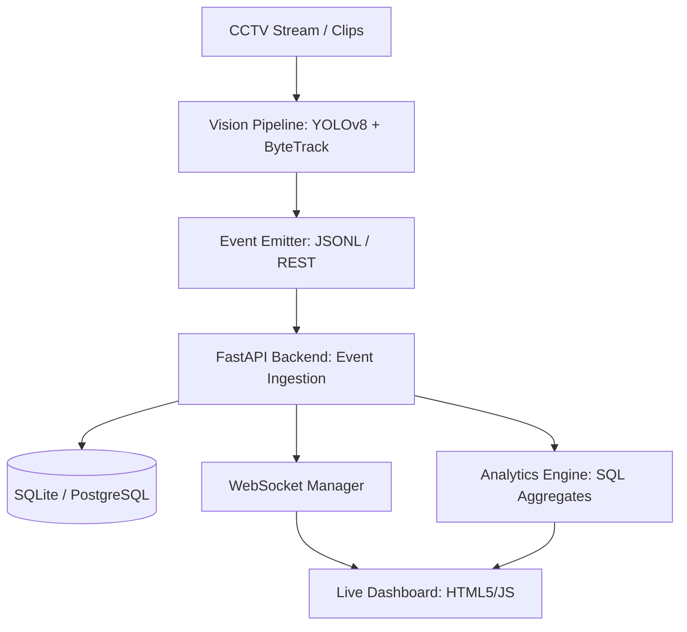

# 🏬 Apex Retail — Store Intelligence Platform

[](https://fastapi.tiangolo.com)
[](https://www.python.org/downloads/)
[](https://ultralytics.com)
[](https://developer.mozilla.org/en-US/docs/Web/API/WebSockets_API)

**Store Intelligence** is a high-performance, end-to-end pipeline designed to transform raw CCTV footage into actionable retail analytics. From detecting visitor movement patterns to generating real-time heatmaps and conversion funnels, this platform provides a 360° view of store performance.

---

## 🚀 Key Features

- **🧠 Real-time Vision Core**: Integrated YOLOv8m + ByteTrack for precise object detection and multi-object tracking (MOT).
- **📊 Intelligence Dashboard**: A responsive, WebSocket-driven interface showing:
  - **Conversion Funnel**: Entry → Zone Visit → Billing → Purchase.
  - **Dynamic Heatmaps**: Zone-wise visit frequency and dwell time normalization.
  - **Visitor Flow**: Hourly trends of entries vs. exits.
- **🚨 Anomaly Detection**: Automated alerts for long queues, low conversion, and feed stale-ness.
- **⚡ High-Performance API**: Built with FastAPI, featuring structured logging, trace ID tracking, and idempotent event ingestion.
- **🧪 Production Ready**: Modular architecture with >70% test coverage and Docker support.

---

## 🏗️ Architecture Overview



---

## 🛠️ Quick Start (Local Run)

### 1. Setup Environment
```bash
python -m venv venv
source venv/lib/site-packages/source venv/bin/activate  # .\venv\Scripts\activate on Windows
pip install -r requirements.txt
```

### 2. Run the Application
Start the backend and frontend simultaneously:
```bash
# Terminal 1: Backend
uvicorn app.main:app --reload --port 8000

# Terminal 2: Dashboard (Simple Server)
python -m http.server 3000 --directory dashboard
```

### 3. Generate Sample Data
To see the dashboard in action without real clips:
```bash
python pipeline/simulate.py --all-stores --duration-minutes 60 --visitors 50
```

---

## 📈 Analytics API Endpoints

| Method | Endpoint | Purpose |
|--------|----------|---------|
| `POST` | `/events/ingest` | High-throughput event ingestion (Idempotent) |
| `GET` | `/stores/{id}/metrics` | Real-time conversion, dwell, and queue metrics |
| `GET` | `/stores/{id}/funnel` | Multi-stage conversion path analysis |
| `GET` | `/stores/{id}/heatmap` | Spatial density and engagement score |
| `GET` | `/health` | System health & feed freshness monitoring |

---

## 🛡️ Technical Choices & Reasoning

- **FastAPI**: Chosen for its asynchronous capabilities and native Pydantic validation, critical for high-concurrency event streams.
- **SQLite**: Used for simplicity in development with the ability to scale to **PostgreSQL** via environment variables.
- **Nginx & WebSockets**: Ensures low-latency updates for the live dashboard without polling overhead.
- **Structured Logging**: Every request is tagged with a `trace_id` for distributed debugging and performance monitoring.

---

## 👨‍💻 Author
**Aditya**
*Store Intelligence Assignment Solution*
