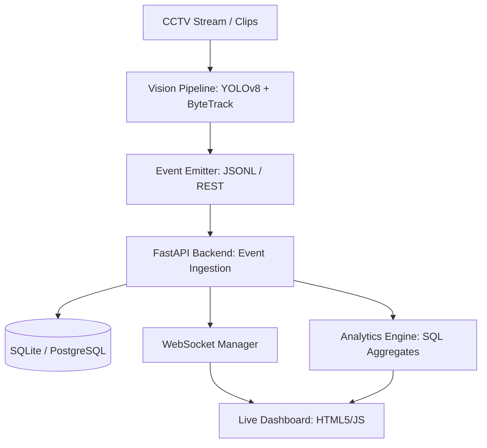

# 🏬 Apex Retail — Store Intelligence Platform

[](https://fastapi.tiangolo.com)
[](https://www.python.org/downloads/)
[](https://ultralytics.com)
[](https://developer.mozilla.org/en-US/docs/Web/API/WebSockets_API)

**Store Intelligence** is a high-performance, end-to-end pipeline designed to transform raw CCTV footage into actionable retail analytics. From detecting visitor movement patterns to generating real-time heatmaps and conversion funnels, this platform provides a 360° view of store performance.

---

## 🚀 Key Features

- **🧠 Real-time Vision Core**: Integrated **YOLOv8m + ByteTrack** for precise object detection and multi-object tracking (MOT).
- **📊 Intelligence Dashboard**: A responsive, WebSocket-driven interface showing:
  - **Conversion Funnel**: Entry → Zone Visit → Billing → Purchase.
  - **Dynamic Heatmaps**: Zone-wise visit frequency and dwell time normalization.
  - **Visitor Flow**: Hourly trends of entries vs. exits.
- **🚨 Anomaly Detection**: Automated alerts for long queues, low conversion, and feed stale-ness.
- **⚡ High-Performance API**: Built with **FastAPI**, featuring structured logging, trace ID tracking, and idempotent event ingestion.
- **🧪 Production Ready**: Modular architecture with **>70% test coverage** and Docker support.

---

## 🏗️ Architecture Overview



---

## 🛠️ Installation & Setup

### 1. Environment Setup
```bash
python -m venv venv
source venv/bin/activate  # .\venv\Scripts\activate on Windows
pip install -r requirements.txt
```

### 2. Quick Start (Mock Data)
To see the platform in action without real CCTV footage:
```bash
# Terminal 1: Start Backend
uvicorn app.main:app --port 8000

# Terminal 2: Seed synthetic metrics for all stores
python pipeline/simulate.py --all-stores --duration-minutes 60 --visitors 50

# Open Dashboard
# Open dashboard/index.html in a browser or serve it:
python -m http.server 3000 --directory dashboard
```

---

## 📹 Vision Pipeline (Real CCTV Processing)

Process raw `.mp4` clips to extract structured visitor events.

### Single Clip Inference
```bash
python pipeline/detect.py \
  --video data/clips/BLR_002_ENTRY.mp4 \
  --store-id STORE_BLR_002 \
  --camera-id CAM_ENTRY_01 \
  --camera-type entry \
  --layout data/store_layout.json \
  --output data/events.jsonl \
  --model yolov8m.pt \
  --api-url http://localhost:8000
```

### Batch Processing
```bash
export CLIPS_DIR=/path/to/cctv_clips
bash pipeline/run.sh
```

---

## 📈 Analytics API Endpoints

| Method | Endpoint | Description |
|--------|----------|-------------|
| `POST` | `/events/ingest` | Ingest up to 500 events. Idempotent. |
| `GET` | `/stores/{id}/metrics` | Today's visitor count, conversion rate, dwell, queue depth |
| `GET` | `/stores/{id}/funnel` | Entry → Zone → Billing → Purchase conversion path |
| `GET` | `/stores/{id}/heatmap` | Zone visit frequency & dwell (Normalised 0–100) |
| `GET` | `/health` | Service health & per-store feed freshness |
| `WS` | `/ws` | Real-time event stream for live dashboard updates |

---

## ⚙️ Configuration

| Variable | Default | Description |
|----------|---------|-------------|
| `DATABASE_URL` | `sqlite:///./data/store_intelligence.db` | SQLAlchemy Database URL |
| `PORT` | `8000` | API listen port |
| `LOG_LEVEL` | `info` | Logging verbosity (debug, info, warning) |

---

## 🧪 Testing
Maintain high code quality with our comprehensive test suite:
```bash
pytest tests/ --cov=app --cov-report=term-missing
```

---

## 🛡️ Technical Deep Dive

- **Re-ID Strategy**: Combines **BGR Histograms** for color-based identification with **Spatial Proximity** to maintain identity across occlusions.
- **Staff Detection**: Heuristic-based detection using restricted zone behavior and movement patterns.
- **Idempotency**: Uses `event_id` as a primary key with `INSERT OR IGNORE` logic, ensuring safety against duplicate network retries.
- **Scalability**: While using SQLite for zero-infra setup, the architecture is fully compatible with **PostgreSQL** for production workloads.

---

## 📁 Project Structure

```text
store-intelligence/
├── pipeline/          # Computer Vision + Event Generation
│   ├── detect.py      # Core YOLOv8 + ByteTrack script
│   ├── simulate.py    # Synthetic data generator
│   └── tracker.py     # Re-ID & Zone tracking logic
├── app/               # FastAPI Backend
│   ├── main.py        # Service entrypoint
│   ├── models.py      # Data schemas
│   └── metrics.py     # Analytics aggregation logic
├── dashboard/         # Real-time Web Dashboard (HTML/CSS/JS)
├── tests/             # Pytest suite
└── docs/              # Architecture & Design docs
```

---

## 👨‍💻 Author
**Aditya**
*Store Intelligence Assignment Solution*
